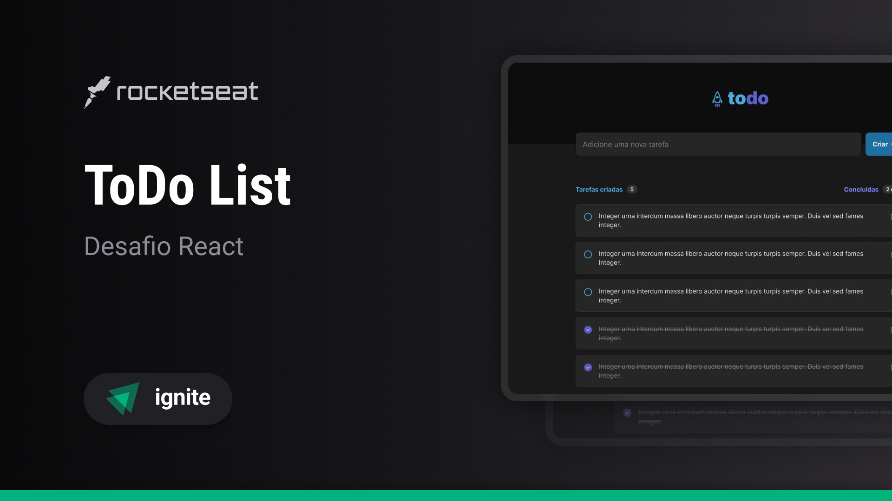
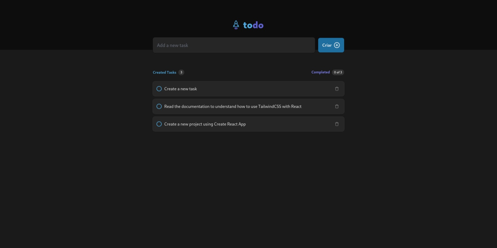

# Ignite Feed
[](#)
***Frontend challenge of my React JS training.***

> Status: Finished... ✅

## Technologies 🚀


## Features 💡

✅ **ADD TASKS**

✅ **DELETE TASKS**

✅ **CHECK AND UNCHECK TASKS**

✅ **SHOW PROGRESS OF TAKS**

## How do use the project ⚙️

### 1. Clone repository
```sh
git clone https://github.com/reinheimermat/todo-list
```
### 2. Install dependencies
```sh
npm install
```

### 3. Run local project
```sh
npm run dev
```
### 4. Access the project
```sh
http://localhost:5173/
```

## License 📝

[](https://github.com/Ileriayo/markdown-badges/blob/master/LICENSE)

## LINKS 🔗

[](https://www.linkedin.com/in/reinheimermat/)
[](mailto:contatoreinheimer@gmail.com)

<center></center>